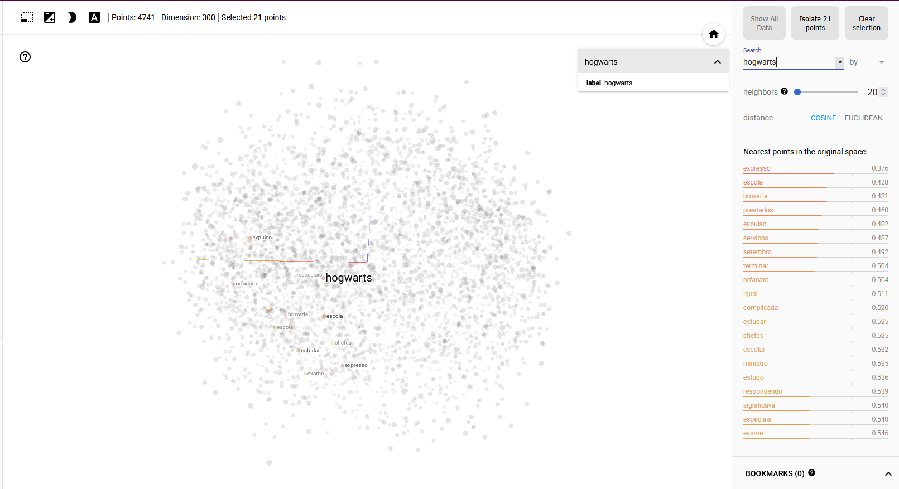

<h1> TPC 9 - Treino de Modelos com Word2Vec </h1>

Este projeto demonstra a utilização de word embeddings para visualizar as relações semânticas entre palavras com base em dois documentos da saga *Harry Potter* . Os modelos de word embedding tornaram-se ferramentas essenciais para captar estas relações, representando as palavras como vectores de alta dimensão que codificam a semelhança semântica com base na sua utilização em grandes corpus de texto.

